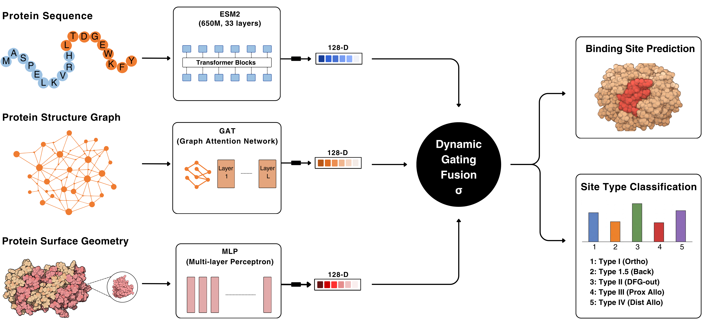

# 🧬 AlloGNN: Multi-Modal Graph Neural Network with Residue-Level Gated Fusion

Official PyTorch implementation of **"ALLOGNN: A Multi-Modal Graph Neural Network with Residue-Level Gated Fusion for Allosteric Binding Site Prediction in Human Protein Kinases."**

AlloGNN is a multi-modal deep learning framework for residue-level prediction of active and allosteric binding sites in human protein kinases. The framework integrates evolutionary sequence information, structural topology, and local surface/biophysical features through a learned residue-level gating mechanism.

AlloGNN addresses the limitations of sequence-only binding-site prediction for structurally and evolutionarily diverse allosteric sites, achieving an **11.08-fold relative improvement in AUPR** over the LBS-pLM baseline for distal allosteric (Type IV) sites.

---

## Overview

AlloGNN integrates three complementary biological modalities:

- **Sequence Stream (Evolutionary Context):** Extracts deep protein representations using the frozen **ESM2-650M** protein language model.
- **Structure Stream (Spatial Topology):** Propagates sequence information over a residue-level C$\alpha$ contact graph using **Graph Attention Convolution (GATConv)**.
- **Surface Stream (Local Biophysical Profiling):** Encodes local physical characteristics including relative SASA, crystallographic B-factor, and secondary structure.
- **Residue-Level Gated Fusion:** A learned softmax gating mechanism dynamically assigns modality-specific weights to individual residues.

<p align="center">
  
</p>

AlloGNN predicts five kinase binding-site classes:

1. **Kinase Type I** — Orthosteric
2. **Kinase Type I.5** — Back-pocket
3. **Kinase Type II** — DFG-out
4. **Kinase Type III** — Proximal allosteric
5. **Kinase Type IV** — Distal allosteric

---

## 📄 Paper & Dataset

**Paper:**  
*ALLOGNN: A Multi-Modal Graph Neural Network with Residue-Level Gated Fusion for Allosteric Binding Site Prediction in Human Protein Kinases*

**Dataset & Pre-trained Model:**  
[Zenodo — 10.5281/zenodo.21978244](https://doi.org/10.5281/zenodo.21978244)

The Zenodo release contains the precomputed PyTorch Geometric graphs, ESM2-650M residue embeddings, metadata, dataset splits, and pre-trained model checkpoint required to reproduce the reported experiments.

---

# Quick Start

### 1. Clone the repository

```bash
git clone https://github.com/srajalcodes/AlloGNN.git
cd AlloGNN
```

### 2. Create the Conda environment

```bash
conda env create -f environment.yml
conda activate allognn
```

### 3. Download the precomputed dataset

```bash
python download_data.py
```

The script downloads the **~14.8 GB** AlloGNN archive from Zenodo and automatically restores the required directory structure.

### 4. Evaluate the pre-trained model

```bash
python evaluation.py
```

This evaluates the released model on the **unseen gene-cold test set containing 812 chains**.

---

# 🗂️ Dataset Structure

After running `download_data.py`, the precomputed resources are organized as:

```text
AlloGNN/
│
├── data/
│   ├── raw/
│   │   └── kincore/
│   │       └── kincore_metadata.tab
│   │
│   └── processed/
│       ├── embeddings/
│       │   └── esm2_embeddings.h5
│       │
│       └── graphs/
│           ├── *.pt
│           └── ...
│
├── output/
│   └── checkpoints/
│       └── best_allo_*.pt
│
├── results/
│
├── evaluation.py
├── train.py
├── run_ablations.py
├── download_data.py
├── environment.yml
└── README.md
```

The released dataset contains **9,217 protein chains**, precomputed ESM2-650M residue representations, PyTorch Geometric graphs, surface features, metadata, dataset splits, and a pre-trained AlloGNN checkpoint.

---

# Ablation Study

To reproduce the targeted ablation experiments reported in **Table V**:

```bash
python run_ablations.py
```

The ablation experiments evaluate the contribution of the individual modalities and the proposed residue-level gated fusion mechanism.

---

# Training

To train AlloGNN using the prepared dataset:

```bash
python train.py
```

The training pipeline integrates the sequence, structural, and surface representations through the proposed residue-level gated fusion architecture.

---

# Results

## Head-to-Head Comparative Performance

Performance on the **unseen gene-cold test set** using micro-averaged AUPR:

| Target Site Class | LBS-pLM AUPR | P2Rank AUPR | AlloGNN AUPR (Ours) |
|---|---:|---:|---:|
| Kinase Type I (Orthosteric) | 0.629 | 0.485 | **0.754** |
| Kinase Type I.5 (Back-pocket) | 0.749 | 0.578 | **0.878** |
| Kinase Type II (DFG-out) | 0.680 | 0.613 | **0.856** |
| Kinase Type III (Proximal Allosteric) | 0.363 | 0.559 | **0.940** |
| Kinase Type IV (Distal Allosteric) | 0.077 | 0.375 | **0.853** |

> **Key finding:** AlloGNN achieves an **11.08-fold relative AUPR improvement** over the sequence-only LBS-pLM baseline for Type IV distal allosteric sites.

---

# 🧬 Binding-Site Classes

| Site Class | Description |
|---|---|
| **Type I** | Orthosteric ATP-binding site |
| **Type I.5** | Back-pocket binding site |
| **Type II** | DFG-out conformation / adjacent site |
| **Type III** | Proximal allosteric site |
| **Type IV** | Distal allosteric site |

---

# 📚 Citation

If you use AlloGNN, its dataset, or the associated code in your research, please cite the following:

```bibtex
@inproceedings{allognn2026,
  title={ALLOGNN: A Multi-Modal Graph Neural Network with Residue-Level Gated Fusion for Allosteric Binding Site Prediction in Human Protein Kinases},
  author={Tiwari, Srajal and Sharma, Dolly},
  year={2026}
}
```

### Dataset

```bibtex
@dataset{tiwari2026allognn,
  author       = {Tiwari, Srajal and Sharma, Dolly},
  title        = {AlloGNN: Data and Pre-Trained Models for Allosteric Binding Site Prediction in Human Protein Kinases},
  year         = {2026},
  publisher    = {Zenodo},
  version      = {1.0.0},
  doi          = {10.5281/zenodo.21978244}
}
```

---

# License

This project is licensed under the **MIT License**.

---

# Contact

For questions regarding the AlloGNN implementation, dataset, or reproducibility materials, please open an issue in this repository.

**GitHub:**  
https://github.com/srajalcodes/AlloGNN

**Zenodo:**  
https://doi.org/10.5281/zenodo.21978244